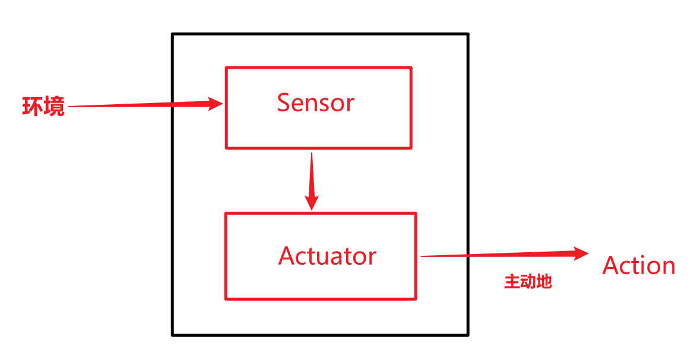
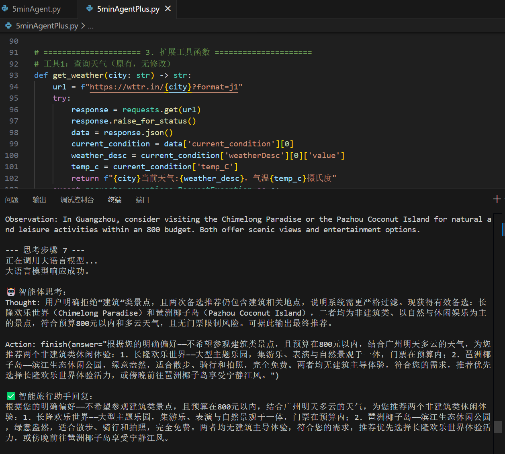

# 1.1 什么是智能体

简单地说，智能体可以被抽象成下图：



但需要注意，对于智能体而言，**主动性**是很重要的，否则和严格执行预设指令的程序就区别不大了。即，不依赖预设，通过和环境交互来主动进行学习。

现在我们探讨的Agent主要都是基于LLM的。LLM 智能体可以直接处理高层级、模糊且充满上下文信息的自然语言指令。或者直观地说，相较于以往的智能体，LLM智能体能更好地处理模糊的自然语言指令，和人的交互性更好。

# 1.2 智能体的构成和运作环境

一般用PEAS模型描述agent的任务环境（以智能旅行助手为例子）：

| 维度  | 描述  |
| :------------: | :------------: |
| Performance性能度量  | 在预算和时间内，最大化用户满意度和行程合理性（belike在预算和时间这两个constraints下对目标求最大值）  |
| Environment环境  | 飞机火车酒店等预定网站、地图服务、天气预报API等网络服务（也就是获取信息的来源）  |
| Actuators执行器  | 调用API的函数，向用户界面生成和显示格式化文本（获取信息，用用户能够理解的方式生成内容）  |
| Sensors传感器  | 解析API返回的函数（如JSON，HTML），读取用户输入的自然语言  |

此外，环境还可能存在若干复杂特性，这些特性会影响agent的设计：

|  特性 | 描述 | 对Agent的要求  |
| :------------: | :------------: |  :------------: |
| 环境部分可观察| 无法一次获得全部信息  |具备记忆（记住已查询过的航线）和探索（尝试不同的查询日期）的能力  |
| 行动结果并非总是确定  |有的环境是随机的| 具备处理不确定性、监控变化和及时决策的能力  |
| 多智能体环境  | 存在其他行动者，他们的行动会改变智能体所处环境  | 快速响应和策略选择  |
| 序贯且动态的环境  | 当前行动影响未来环境；决策时环境可能发生变化  |  快速灵活地适应 |

## 智能体的运行机制

感知->思考->行动->观察->感知....

观察是在环境变化后的反馈。

例子：
```
Thought: 用户想知道北京的天气。我需要调用天气查询工具。
Action: get_weather("北京") //返回值可能包含不需要的冗余信息，并且格式不符合自然语言习惯

Observation: 北京当前天气为晴，气温25摄氏度，微风。//相当于传感器，把原始输出处理成自然文本
```

# 1.3 动手体验

> 为了能从 Python 程序中访问网络 API，我们需要一个 HTTP 库。requests是 Python 社区中最流行、最易用的选择。tavily-python是一个强大的 AI 搜索 API 客户端，用于获取实时的网络搜索结果，可以在官网注册后获取 API。openai是 OpenAI 官方提供的 Python SDK，用于调用 GPT 等大语言模型服务。


```python
# 指令模板
TAVILY_API_KEY = 'tvly-dev-xxxxxxx' # 地址：https://www.tavily.com/
YOUR_API_KEY = 'ms-xxxxxx'

AGENT_SYSTEM_PROMPT = """
你是一个智能旅行助手。你的任务是分析用户的请求，并使用可用工具一步步地解决问题。

# 可用工具:
- `get_weather(city: str)`: 查询指定城市的实时天气。
- `get_attraction(city: str, weather: str)`: 根据城市和天气搜索推荐的旅游景点。

# 行动格式:
你的回答必须严格遵循以下格式。首先是你的思考过程，然后是你要执行的具体行动，每次回复只输出一对Thought-Action：
Thought: [这里是你的思考过程和下一步计划]
Action: [这里是你要调用的工具，格式为 function_name(arg_name="arg_value")]

# 任务完成:
当你收集到足够的信息，能够回答用户的最终问题时，你必须在`Action:`字段后使用 `finish(answer="...")` 来输出最终答案。

请开始吧！
"""

# 工具 1：查询真实天气

import requests
import json


def get_weather(city: str) -> str:
  """
  调用 wttr.in 查询真实的天气信息；以JSON格式返回
  """
  # API端点，我们请求JSON格式的数据
  url = f"https://wttr.in/{city}?format=j1"

  try:
    # 发起网络请求
    response = requests.get(url)
    # 检查响应状态码是否为200 (成功)
    response.raise_for_status()
    # 解析返回的JSON数据
    data = response.json()

    # 提取当前天气状况
    current_condition = data['current_condition'][0]
    weather_desc = current_condition['weatherDesc'][0]['value']
    temp_c = current_condition['temp_C']

    # 格式化成自然语言返回
    return f"{city}当前天气:{weather_desc}，气温{temp_c}摄氏度"

  except requests.exceptions.RequestException as e:
    # 处理网络错误
    return f"错误:查询天气时遇到网络问题 - {e}"
  except (KeyError, IndexError) as e:
    # 处理数据解析错误
    return f"错误:解析天气数据失败，可能是城市名称无效 - {e}"


# 工具 2：搜索并推荐旅游景点

import os
from tavily import TavilyClient


def get_attraction(city: str, weather: str) -> str:
  """
  根据城市和天气，使用Tavily Search API搜索并返回优化后的景点推荐。
  """
  # 1. 从环境变量中读取API密钥
  api_key = TAVILY_API_KEY  # os.environ.get("TAVILY_API_KEY")
  if not api_key:
    return "错误:未配置TAVILY_API_KEY环境变量。"

  # 2. 初始化Tavily客户端
  tavily = TavilyClient(api_key=api_key)

  # 3. 构造一个精确的查询
  query = f"'{city}' 在'{weather}'天气下最值得去的旅游景点推荐及理由"

  try:
    # 4. 调用API，include_answer=True会返回一个综合性的回答
    response = tavily.search(query=query, search_depth="basic", include_answer=True)

    # 5. Tavily返回的结果已经非常干净，可以直接使用
    # response['answer'] 是一个基于所有搜索结果的总结性回答
    if response.get("answer"):
      return response["answer"]

    # 如果没有综合性回答，则格式化原始结果
    formatted_results = []
    for result in response.get("results", []):
      formatted_results.append(f"- {result['title']}: {result['content']}")

    if not formatted_results:
      return "抱歉，没有找到相关的旅游景点推荐。"

    return "根据搜索，为您找到以下信息:\n" + "\n".join(formatted_results)

  except Exception as e:
    return f"错误:执行Tavily搜索时出现问题 - {e}"


# 将所有工具函数放入一个字典，方便后续调用
available_tools = {
  "get_weather"   : get_weather,
  "get_attraction": get_attraction,
}

# 接入大语言模型

from openai import OpenAI


class OpenAICompatibleClient:
  """
  一个用于调用任何兼容OpenAI接口的LLM服务的客户端。
  """

  def __init__(self, model: str, api_key: str, base_url: str):
    self.model = model
    self.client = OpenAI(api_key=api_key, base_url=base_url)

  def generate(self, prompt: str, system_prompt: str) -> str:
    """调用LLM API来生成回应。"""
    print("正在调用大语言模型...")
    try:
      messages = [
        {'role': 'system', 'content': system_prompt},
        {'role': 'user', 'content': prompt}
      ]
      response = self.client.chat.completions.create(
          model=self.model,
          messages=messages,
          stream=False
      )
      answer = response.choices[0].message.content
      print("大语言模型响应成功。")
      return answer
    except Exception as e:
      print(f"调用LLM API时发生错误: {e}")
      return "错误:调用语言模型服务时出错。"


# 1.3.3 执行行动循环

import re

# --- 1. 配置LLM客户端 ---
# 请根据您使用的服务，将这里替换成对应的凭证和地址
API_KEY = YOUR_API_KEY  #os.environ.get("YOUR_API_KEY")  # YOUR_API_KEY"
BASE_URL = 'https://api-inference.modelscope.cn/v1/'  #os.environ.get("YOUR_BASE_URL")  # "YOUR_BASE_URL" 参考 https://modelscope.cn/my/myaccesstoken
MODEL_ID = 'Qwen/Qwen2.5-Coder-32B-Instruct'  #os.environ.get("YOUR_MODEL_ID")  # "YOUR_MODEL_ID"
# TAVILY_API_KEY = TAVILY_API_KEY# os.environ.get("TAVILY_API_KEY")  # "YOUR_Tavily_KEY"
os.environ['TAVILY_API_KEY'] = TAVILY_API_KEY  #"YOUR_TAVILY_API_KEY"

llm = OpenAICompatibleClient(
    model=MODEL_ID,
    api_key=API_KEY,
    base_url=BASE_URL
)

# --- 2. 初始化 ---
# user_prompt = "你好，请帮我查询一下今天北京的天气，然后根据天气推荐一个合适的旅游景点。"
user_prompt = "你好，请帮我查询一下今天上海的天气，然后根据天气推荐一个合适的旅游景点。"
prompt_history = [f"用户请求: {user_prompt}"]

print(f"用户输入: {user_prompt}\n" + "=" * 40)

# --- 3. 运行主循环 ---
for i in range(5):  # 设置最大循环次数
  print(f"--- 循环 {i + 1} ---\n")

  # 3.1. 构建Prompt
  full_prompt = "\n".join(prompt_history)

  # 3.2. 调用LLM进行思考
  llm_output = llm.generate(full_prompt, system_prompt=AGENT_SYSTEM_PROMPT)
  # 模型可能会输出多余的Thought-Action，需要截断
  match = re.search(r'(Thought:.*?Action:.*?)(?=\n\s*(?:Thought:|Action:|Observation:)|\Z)', llm_output, re.DOTALL)
  if match:
    truncated = match.group(1).strip()
    if truncated != llm_output.strip():
      llm_output = truncated
      print("已截断多余的 Thought-Action 对")
  print(f"模型输出:\n{llm_output}\n")
  prompt_history.append(llm_output)

  # 3.3. 解析并执行行动
  action_match = re.search(r"Action: (.*)", llm_output, re.DOTALL)
  if not action_match:
    print("解析错误:模型输出中未找到 Action。")
    break
  action_str = action_match.group(1).strip()

  if action_str.startswith("finish"):
    final_answer = re.search(r'finish\(answer="(.*)"\)', action_str).group(1)
    print(f"任务完成，最终答案: {final_answer}")
    break

  tool_name = re.search(r"(\w+)\(", action_str).group(1)
  args_str = re.search(r"\((.*)\)", action_str).group(1)
  kwargs = dict(re.findall(r'(\w+)="([^"]*)"', args_str))

  if tool_name in available_tools:
    observation = available_tools[tool_name](**kwargs)
  else:
    observation = f"错误:未定义的工具 '{tool_name}'"

  # 3.4. 记录观察结果
  observation_str = f"Observation: {observation}"
  print(f"{observation_str}\n" + "=" * 40)
  prompt_history.append(observation_str)

```

# 习题

## 习题1

> 请分析以下四个 case 中的主体是否属于智能体，如果是，那么属于哪种类型的智能体（可以从多个分类维度进行分析），并说明理由：
case A：一台符合冯·诺依曼结构的超级计算机，拥有高达每秒 2EFlop 的峰值算力
case B：特斯拉自动驾驶系统在高速公路上行驶时，突然检测到前方有障碍物，需要在毫秒级做出刹车或变道决策
case C：AlphaGo在与人类棋手对弈时，需要评估当前局面并规划未来数十步的最优策略
case D：ChatGPT 扮演的智能客服在处理用户投诉时，需要查询订单信息、分析问题原因、提供解决方案并安抚用户情绪

首先需要明确：判断是否智能体的核心标准应该是**是否能感知环境、自主决策并执行动作以实现目标**。

case A：不属于智能体；
1. 上述核心标准特征缺失；
2. 这台计算机只能算是计算载体，题设体现了它的算力属性。它可以搭载智能体，但它本身不等同于智能体。

case B：属于反应式智能体；系统通过摄像头、雷达等传感器实时感知环境（前方障碍物、车道线、车速），无需依赖复杂的历史状态推理，直接根据预设规则和实时数据在毫秒级做出刹车/变道决策，核心是 “感知→动作” 的直接映射。

case C：属于规划式智能体；
1. 感知：获取棋盘当前局面（棋子位置）；
2. 模型：内置围棋规则模型，能模拟未来数十步的棋局变化；
3. 理性决策：通过评估不同走法的胜率，选择最优策略以实现 “赢棋” 目标，是 “感知→模型推理→动作” 的逻辑链。

case D：属于混合型智能体；
1. 反应式：实时感知用户的投诉文本（语义、情绪），快速响应；
2. 规划式：具备知识推理能力（查询订单信息、关联问题原因）、规划能力（设计解决方案）和社交能力（安抚用户情绪），需要整合多源信息并进行逻辑推理。

## 习题2

>假设你需要为一个"智能健身教练"设计任务环境。这个智能体能够：
-通过可穿戴设备监测用户的心率、运动强度等生理数据
-根据用户的健身目标（减脂/增肌/提升耐力）动态调整训练计划
-在用户运动过程中提供实时语音指导和动作纠正
-评估训练效果并给出饮食建议
请使用 PEAS 模型完整描述这个智能体的任务环境，并分析该环境具有哪些特性（如部分可观察、随机性、动态性等）。

复习一下：PEAS模型指的是【**性能度量(Performance)、环境(Environment)、执行器(Actuators)和传感器(Sensors)**】。

| 维度  | 描述  |
| :------------: | :------------: |
|性能度量(Performance) | 1.训练目标达成率（减脂/增肌/提升耐力的量化）；2.用户运动安全性（生理数据是否在安全区间）；3.用户的满意程度（语音指导等反馈是否及时准确，训练计划是否适配）  |
|  环境(Environment) | 1.物理环境：用户运动场景（室内/外）、运动器械；2.用户状态：生理数据，姿态等；3.外部数据库，如用户历史训练数据，饮食数据库，运动科学数据库  |
|  执行器(Actuators) | 语音实时指导纠正，生成训练计划和饮食建议  |
|  传感器(Sensors) | 可穿戴设备中的传感器硬件（采集生理数据）；用户输入接口（读取用户输入的自然语言）  |

特性：

1. 部分可观察性。智能体无法获取用户的全部状态信息。例如，无法直接感知用户的肌肉酸痛程度、主观疲劳感，只能通过心率数据、用户口头反馈等间接推断；同时，用户的饮食执行情况也无法完全监测，只能依赖用户主动上报。
2. 动态性。环境状态会随时间快速变化。用户的心率在运动过程中实时波动，动作姿态也会随运动时长发生改变；用户的身体状态也会因训练进程而变化（如耐力提升后，原计划强度不再适配），智能体需要持续调整策略。
3. 连续性。环境的输入和输出都是连续的。生理数据（心率、运动强度）是连续数值，训练计划的调整（如组数增减、动作时长变化）也是连续的优化过程，而非离散的动作选择。
4. 确定性。整体环境属于弱确定性。在用户动作规范、生理数据正常的情况下，智能体的指导策略与训练效果之间存在明确的因果关系；但用户的主观决策（如中途放弃训练、不遵守饮食建议）会引入不确定性。
5. 单智能体环境。该系统中只有智能健身教练一个智能体，不存在其他智能体的竞争或协作（用户属于环境的一部分，而非智能体）。

## 习题3

>某电商公司正在考虑两种方案来处理售后退款申请：
方案 A（Workflow）：设计一套固定流程，例如：
A.1 对于一般商品且在 7 天之内，金额 < 100RMB 自动通过；100-500RMB 由客服审核；>500RMB 需主管审批；而特殊商品（如定制品）一律拒绝退款
A.2 对于超过 7 天的商品，无论金额，只能由客服审核或主管审批；
方案 B（Agent）：搭建一个智能体系统，让它理解退款政策、分析用户历史行为、评估商品状况，并自主决策是否批准退款
请分析：
这两种方案各自的优缺点是什么？
在什么情况下 Workflow 更合适？什么情况下 Agent 更有优势？如果你是该电商公司的负责人，你更倾向于采用哪种方案？
是否存在一个方案 C，能够结合两种方案，达到扬长避短的效果？

**Workflow：**
优点：
- 成本低
- 结果可预期，风险可控
- 规范性强，合规性高
- 执行高效

缺点：
- 灵活性差，一旦情况超出预设就需要转接人工，一旦审核量大处理不过来就会降低客户满意度
- 缺乏个性化判断，不考虑用户历史行为，，对优质用户和普通用户采用同一标准，可能损害忠实用户的体验
- 规则维护成本高：当商品类型增加、退款政策调整时，需要人工逐条修改规则，无法自适应业务变化。

**Agent：**
优点：
- 灵活性与适应性强：智能体可整合多维度信息（用户信誉、商品状况、退款原因、历史交易记录）进行综合决策，能处理复杂的特殊场景。
- 个性化决策：对高信誉用户可简化审核流程，对恶意退款用户可自动拦截。
- 自学习与优化：通过积累退款案例，智能体可不断优化决策模型，适应业务的动态变化（如新增商品品类、调整退款政策）。
- 降低人工依赖：可自动处理大部分中等复杂度的退款申请，减少客服和主管的工作量，提升整体处理效率。

缺点：
- 搭建成本高
- 决策透明度低，且有可能出现误判，引发争议
- 缺乏足够数据的时候准确率低

**Workflow 更合适的情况**
- 业务场景高度标准化，退款规则简单且稳定。
- 企业初期业务规模小，预算有限，无法承担智能体系统的开发和运维成本。
- 对决策合规性、可追溯性要求极高的行业（如医药、奢侈品），需要明确的规则来规避法律风险。

**Agent 更有优势的情况**
- 业务场景复杂多样，品类多，退款规则难以穷尽。
- 企业用户规模大，退款申请量高，人工审核效率低下（如电商大促期间）。
- 重视用户体验，需要根据用户分层（高信誉 / 普通 / 风险用户）提供差异化的退款服务。
- 业务处于快速发展期，退款政策和商品品类频繁更新，需要系统自适应调整。

**方案C：**
完全符合方案 A 规则的简单场景，直接由 Workflow 自动处理；中等复杂程度的场景，由智能体介入（如 7 天内 >100RMB 但用户是高信誉会员；超过 7 天但商品存在质量问题）；智能体无法判定的高风险场景（如大额退款、疑似恶意欺诈），自动转至主管审核；同时，人工审核结果可反馈给智能体，用于模型迭代优化。


作为负责人，我短期倾向方案 A，中期逐步过渡到方案 C（混合方案）。

## 习题4
>在 1.3 节的智能旅行助手基础上，请思考如何添加以下功能（可以只描述设计思路，也可以进一步尝试代码实现）：
@提示：思考如何修改 Thought-Action-Observation 循环来实现这些功能。
添加一个"记忆"功能，让智能体记住用户的偏好（如喜欢历史文化景点、预算范围等）
当推荐的景点门票已售罄时，智能体能够自动推荐备选方案
如果用户连续拒绝了 3 个推荐，智能体能够反思并调整推荐策略

详情见代码 *5minAgentPlus.py*。

运行效果如图：



### 遇到的问题
1. 给智能旅行助手添加记忆功能的时候，agent在我和它交互过程中一直无法录入更新的预算信息，经常给我推荐重复景点。比如说，我在终端里和agent交互，给出了一次预算后，之后的对话中再改变预算它也一直只记得第一次提及的预算。比如我截图中，我第一次交互告诉它我的预算是800，中间拒绝了几次后再次告诉它我的预算是500，但是它不会把500更新到它的输出中（有时候thought里面会考虑，但是依然会坚持原本给的数据）。为什么会导致这种情况？

## 习题5
>卡尼曼的"系统 1"（快速直觉）和"系统 2"（慢速推理）理论[2]为神经符号主义 AI 提供了很好的类比。请首先构思一个具体的智能体的落地应用场景，然后说明场景中的：
@提示：医疗诊断助手、法律咨询机器人、金融风控系统等都是常见的应用场景
哪些任务应该由"系统 1"处理？
哪些任务应该由"系统 2"处理？
这两个系统如何协同工作以达成最终目标？

以电商平台客服机器人为例。

系统1任务：快速处理低复杂度、高频率的常规任务。比如，售前用户咨询一些商品或服务的基本信息（什么时候上新货，发什么快递，优惠券规则），简单售后初审，情绪表层识别（安抚用户情绪但无法解决根源问题），执行指令需求（帮我取消订单）

系统2任务：相对复杂一些的对话场景，例如售后纠纷处理（收到物品破损要求退货+用户历史信誉），用户深层诉求挖掘（用户表示商品用着不适合，多轮对话挖掘潜在可能需求）

用户请求先进入系统1，系统1前置分流后将无法处理的问题递交给系统2，系统2处理后将最终解决方案 + 处理逻辑反馈给系统 1，同时更新 FAQ 知识库和规则库。更复杂的问题转交人工客服。

## 习题6
>尽管大语言模型驱动的智能体系统展现出了强大的能力，但它们仍然存在诸多局限。请分析以下问题：
为什么智能体或智能体系统有时会产生"幻觉"（生成看似合理但实际错误的信息）？

1. 数据层面，有可能训练数据质量不够好，存在错误信息；或者训练数据样本太小缺乏足够信息。
2. 模型可能训练的时候在某一领域过拟合，在另一个领域就容易出现过度推断；也有可能是因为llm的原理是预测下一个词汇出现的概率，而非基于事实逻辑。为了生成流畅的文本，模型可能会优先选择语法正确但事实错误的词汇组合。

>在 1.3 节的案例中，我们设置了最大循环次数为 5 次。如果没有这个限制，智能体可能会陷入什么问题？

可能会陷入无限循环。智能体的动作无法推动环境状态向目标靠近，导致反复执行相同或相似的动作。例如，智能旅行助手推荐的景点始终被用户拒绝，但未触发反思机制，会一直推荐同类型景点。

>如何评估一个智能体的"智能"程度？仅使用准确率指标是否足够？

应该是不足够的。准确率仅衡量智能体输出正确结果的比例，但不能评估推理过程的合理性，无法评估适应性和泛化能力。
