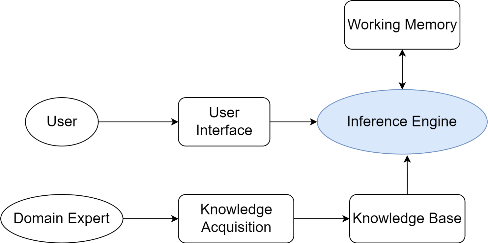

# 2.1 早期智能体（符号与逻辑）
符号主义（Symbolicism），也被称为“逻辑AI”或“传统AI”。“智慧”完全来源于设计者预先编码的知识库和推理规则，而非通过自主学习获得。是否可以认为此类智能体其实就是类似于workflow或者脚本？只不过灵活程度传统智能体>workflow>脚本。

## 2.1.1 物理符号系统

简单符号可以构成复杂结构，过程则可以创建、修改、复制和销毁这些符号结构。

## 2.1.2 符号AI-专家系统（深度）
**专家系统**
&emsp;&emsp;|——知识库
&emsp;&emsp;|——推理机
&emsp;&emsp;|——用户界面

**知识库（Knowledge Base）**
存放领域专家的知识和经验。常用知识表达方法：*一系列“IF-THEN”形式的条件语句*。
例如：IF 病人有发烧症状 AND 咳嗽 THEN 可能患有呼吸道感染。

**推理机（Inference Engine）**
用户提供的事实→在知识库中寻找并应用相关的规则→推导出新的结论。
1. 正项链（Forward Chaining）：数据驱动。已知事实→不断匹配规则的IF部分→触发THEN部分的结论→将新结论加入事实库→最终推导出目标或无新规则可匹配。即事实→结论→新的结论作为事实，**推断**。
2. 反向链（Backward Chaining）：目的驱动。假设的目标（比如“病人是否患有肺炎”）→能够推导出该目标的规则→将该规则的IF部分作为新的子目标→递归直到所有子目标都能被已知事实所证明。即目标→事实，**证明**。

## 2.1.3 符号AI-SHRDLU（广度）
首次将多个独立的人工智能模块（如语言解析、规划、记忆）集成在一个统一的系统中，并使它们协同工作。
